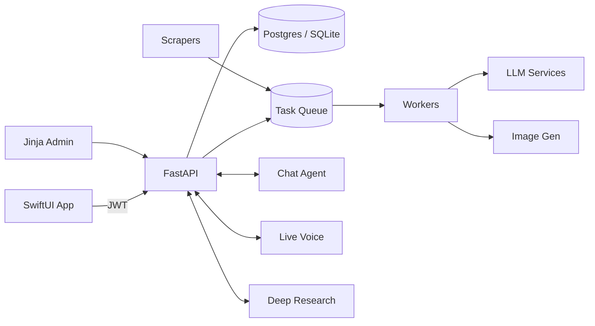

# Newsly

AI-powered knowledge companion with a FastAPI backend, background processing pipeline, and native SwiftUI iOS app.

Newsly ingests content from RSS feeds, scrapers, and user submissions, then analyzes, summarizes, and generates imagery — all served through a JSON API consumed by the iOS client. Users can have deep-dive conversations about saved content, run deep research queries, and use real-time voice to explore their knowledge base or the web.



## Features

**Content pipeline** — Scrapers (HN, Reddit, Substack, Techmeme, podcasts, Atom feeds) and user submissions feed a multi-stage queue: URL analysis, content extraction, LLM summarization, and AI image generation.

**Deep-dive chat** — pydantic-ai agents with Exa web search let users dig deeper into any article, corroborate claims, or start ad-hoc topic conversations.

**Deep research** — Async research sessions powered by OpenAI's deep research model with web search and code interpreter.

**Live voice** — Real-time spoken conversations backed by ElevenLabs STT/TTS. Searches saved knowledge or the web on the fly, with barge-in interruption support.

**iOS app** — Native SwiftUI client with Apple Sign In, share extension for URL submissions, offline-ready feed, and integrated chat/voice.

## Quick Start

```bash
# Install dependencies
uv sync && source .venv/bin/activate

# Configure environment
cp .env.example .env  # then edit with your keys

# Set up database
alembic upgrade head

# Build CSS (Tailwind v4)
npx @tailwindcss/cli -i ./static/css/styles.css -o ./static/css/app.css

# Run services
scripts/start_server.sh     # API server
scripts/start_workers.sh    # Task processing workers
scripts/start_scrapers.sh   # Content scrapers
```

### Required Environment Variables

| Variable | Purpose |
|----------|---------|
| `DATABASE_URL` | Database connection (`sqlite:///./news_app.db` for dev) |
| `JWT_SECRET_KEY` | JWT signing key |
| `ADMIN_PASSWORD` | Admin panel password |

### Optional API Keys

| Variable | Enables |
|----------|---------|
| `OPENAI_API_KEY` | GPT summarization, deep research |
| `ANTHROPIC_API_KEY` | Claude summarization, voice agent |
| `GOOGLE_API_KEY` | Gemini image generation, tweet suggestions |
| `EXA_API_KEY` | Exa web search in chat |
| `ELEVENLABS_API_KEY` | Real-time voice (STT + TTS) |

## Project Structure

```
app/
  core/           Settings, DB, auth, logging
  models/         SQLAlchemy ORM + Pydantic schemas
  routers/        FastAPI routes (auth, API, admin)
  services/       LLM agents, chat, voice, image gen, search
  pipeline/       Task queue processor, workers, handlers
  scraping/       HN, Reddit, Substack, podcast scrapers
  tests/          pytest test suite

client/newsly/    SwiftUI iOS app + ShareExtension
scripts/          Server, worker, scraper entry points
templates/        Jinja2 admin templates
docs/             Architecture docs
```

## API Endpoints

| Endpoint | Description |
|----------|-------------|
| `GET /api/content` | List content (filters, cursor pagination) |
| `GET /api/content/{id}` | Content detail with metadata |
| `POST /api/content/submit` | Submit URL for processing |
| `POST /api/chat/sessions` | Create chat session |
| `POST /api/chat/sessions/{id}/messages` | Send chat message |
| `POST /api/voice/sessions` | Create voice session |
| `WS /api/voice/ws/{id}` | Real-time voice websocket |
| `GET /api/scrapers` | List user feed configs |

Full API and schema details in [`docs/architecture.md`](docs/architecture.md).

## Development

```bash
# Tests
pytest app/tests/ -v

# Lint + format
ruff check .
ruff format .

# Database migrations
alembic revision -m "description"
alembic upgrade head

# iOS app
open client/newsly/newsly.xcodeproj
```

## Content Pipeline

```
URL submitted
  -> ANALYZE_URL (pattern matching + LLM classification)
  -> PROCESS_CONTENT (strategy-based extraction)
  -> SUMMARIZE (interleaved narrative summaries)
  -> GENERATE_IMAGE (AI infographic + thumbnail)
  -> completed
```

Content types: `article`, `podcast`, `news`. Podcasts follow an additional download and Whisper transcription path before summarization.

## Tech Stack

| Layer | Technology |
|-------|-----------|
| Backend | Python 3.13, FastAPI, SQLAlchemy 2, Pydantic v2 |
| AI/ML | pydantic-ai, OpenAI, Anthropic, Google Gemini |
| Voice | ElevenLabs (STT + TTS), Claude Haiku agent |
| Database | PostgreSQL (prod), SQLite (dev), Alembic |
| iOS | SwiftUI, iOS 17+, Apple Sign In |
| Frontend | Jinja2, Tailwind CSS v4 |
| Infra | uv, GitHub Actions, bare-metal rsync deploy |
