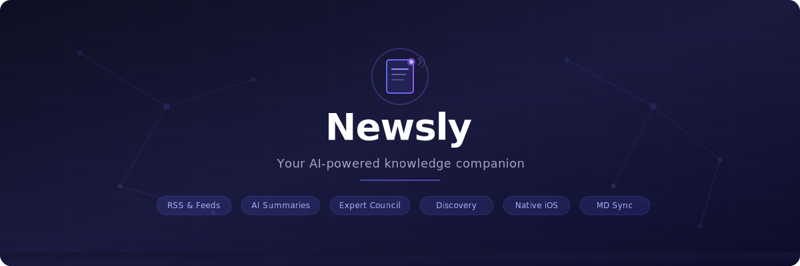

<p align="center">
  <picture>
    <source media="(prefers-color-scheme: dark)" srcset="docs/assets/hero.svg">
    <source media="(prefers-color-scheme: light)" srcset="docs/assets/hero.svg">
    
  </picture>
</p>

<p align="center">
  <strong>Stop drowning in tabs. Start understanding what matters.</strong>
</p>

<p align="center">
  <a href="#getting-started"></a>
  <a href="#getting-started"></a>
  <a href="#cli"></a>
  <a href="#ios-app"></a>
  <a href="https://github.com/willemave/news_app/actions"></a>
  <a href="docs/architecture.md"></a>
</p>

---

Newsly is an AI-powered knowledge companion that keeps you informed without the noise. It pulls in content from RSS feeds, podcasts, Hacker News, Reddit, Techmeme, X bookmarks, and any URL you throw at it — then summarizes everything with LLMs so you get focused, non-sensationalized reading on the things you actually care about.

> **Hosted version coming soon to the App Store.** Or [self-host it yourself](#getting-started) with your own API keys.

<br>

## Highlights

<table>
<tr>
<td width="50%">

### Focused Reading, Zero Noise
Stay informed on the go with content that respects your attention. Newsly delivers non-sensationalized, AI-summarized reading across the topics you care about and what's happening in the world — so you read what matters, when you want to.

</td>
<td width="50%">

### Your Council of Experts
Chat with a council of AI experts grounded in your entire knowledge base. Dig deeper into any article, corroborate claims across sources, and explore new angles — all in one conversation. Think of it as a research team that's read everything you have.

</td>
</tr>
<tr>
<td width="50%">

### RSS Feeds & Long-Form Content
First-class support for RSS and Atom feeds, podcasts, and long-form articles. Subscribe to your favorite blogs, newsletters, and shows — Newsly monitors them continuously and processes new content as it arrives.

</td>
<td width="50%">

### Fast Tech News
Curated, quick-hit summaries from Hacker News, Techmeme, Reddit, and more. Get the signal from the noisiest corners of the internet in seconds, not hours of scrolling.

</td>
</tr>
<tr>
<td width="50%">

### Discover New Knowledge
Newsly surfaces related content and new sources based on what you've read and what's trending across the open web — expanding your knowledge graph without you having to hunt for it.

</td>
<td width="50%">

### Sources You Already Use
Built-in integrations for **X bookmarks & follows**, **Hacker News**, **Techmeme**, **Reddit**, **Substack**, and any RSS/Atom feed. Connect the sources you already follow and let Newsly do the rest.

</td>
</tr>
<tr>
<td width="50%">

### CLI-Powered Content Management
A dedicated CLI lets your AI *claws* manage and curate your library from the terminal. Add feeds, submit one-off articles, manage sources, and organize by topic — the system classifies, processes, and enriches everything automatically so your knowledge base stays fresh.

</td>
<td width="50%">

### Local Markdown Sync
Export and sync your saved knowledge as Markdown files locally. Keep a searchable, offline archive of everything you've read for research, note-taking, or integration with your existing tools.

</td>
</tr>
</table>

<br>

## CLI

The `newsly-agent` CLI (Go, Cobra-based) gives you full control over your knowledge base from the terminal — perfect for scripting, automation, or letting your AI *claws* manage content on your behalf.

```bash
# Authenticate
newsly-agent auth login

# Subscribe to an RSS feed
newsly-agent sources add "https://simonwillison.net/atom/everything/" --feed-type rss --display-name "Simon Willison"

# Submit a one-off article and wait for processing
newsly-agent content submit "https://example.com/great-post" --wait

# Browse your unread content
newsly-agent content list --read-filter unread --limit 20

# Get today's fast news digests
newsly-agent news list --read-filter unread

# Convert a news item into a full article
newsly-agent news convert 4821

# Search across your sources
newsly-agent search "transformer architectures" --limit 10

# Sync your knowledge base to local Markdown
newsly-agent library sync --dir ~/newsly-library --include-source

# List all your feed subscriptions
newsly-agent sources list
```

For full architecture details, see **[docs/architecture.md](docs/architecture.md)**.

<br>

## Getting Started

### Prerequisites

- **Python 3.13+**
- **[uv](https://docs.astral.sh/uv/)** — fast Python package manager
- **Node.js** — for Tailwind CSS build

### Quick Start

```bash
# Clone
git clone https://github.com/willemave/news_app.git
cd news_app

# Install dependencies
uv sync && source .venv/bin/activate

# Configure environment
cp .env.example .env
# Edit .env with your API keys (see table below)

# Set up database
alembic upgrade head

# Build CSS
npx @tailwindcss/cli -i ./static/css/styles.css -o ./static/css/app.css

# Launch
scripts/start_server.sh     # API server on :8000
scripts/start_workers.sh    # Background task workers
scripts/start_scrapers.sh   # Content scrapers
```

### Environment Variables

| Variable | Required | Description |
|----------|:--------:|-------------|
| `DATABASE_URL` | Yes | `sqlite:///./news_app.db` for local dev |
| `JWT_SECRET_KEY` | Yes | Token signing key — generate with `python -c "import secrets; print(secrets.token_urlsafe(32))"` |
| `ADMIN_PASSWORD` | Yes | Admin panel access |
| `ANTHROPIC_API_KEY` | | Summarization, chat agents |
| `OPENAI_API_KEY` | | Summarization, deep research |
| `GOOGLE_API_KEY` | | Image generation (Gemini) |
| `EXA_API_KEY` | | Web search in chat |

<br>

## iOS App

```bash
open client/newsly/newsly.xcodeproj
```

Build and run on a simulator or device. The app connects to `http://127.0.0.1:8000` by default. Features include:

- **Apple Sign In** authentication
- **Share extension** — save content from any app
- **Integrated chat** — converse with your knowledge base
- **Markdown sync** — export knowledge locally

<br>

## Development

```bash
# Run tests
pytest tests/ -v

# Lint & format
ruff check .
ruff format .

# Create a new migration
alembic revision -m "describe your change"

# Apply migrations
alembic upgrade head
```

### Project Structure

```
app/
├── routers/           # API endpoints
├── commands/          # Write operations (CQRS)
├── queries/           # Read operations (CQRS)
├── repositories/      # Data access layer
├── services/          # Business logic & integrations
├── pipeline/          # Task queue workers
├── processing_strategies/  # Content extraction
├── scraping/          # Feed & site scrapers
├── models/            # SQLAlchemy ORM models
└── core/              # Settings, DB, auth
client/
└── newsly/            # SwiftUI iOS app + Share Extension
```

### Deployment

Production deploys are handled via GitHub Actions ([`.github/workflows/bare-metal-deploy.yml`](.github/workflows/bare-metal-deploy.yml)). Do not use `scripts/deploy/push_app.sh` for production.

<br>

## Tech Stack

| Layer | Technologies |
|-------|-------------|
| **Backend** | Python 3.13, FastAPI, SQLAlchemy 2, Pydantic v2 |
| **AI/ML** | pydantic-ai, Anthropic Claude, OpenAI, Google Gemini |
| **CLI** | Go, Cobra, `newsly-agent` binary |
| **iOS** | SwiftUI, Apple Sign In, Share Extension |
| **Frontend** | Jinja2 templates, Tailwind CSS v4 |
| **Infrastructure** | SQLite (Postgres-ready), Alembic, uv, GitHub Actions |

<br>

## Documentation

| Resource | Description |
|----------|-------------|
| **[Architecture](docs/architecture.md)** | System design, database schema, API reference, worker pipeline |
| **[CLAUDE.md](CLAUDE.md)** | Development conventions, coding rules, project guidelines |
| **[docs/library/](docs/library/)** | Operational, deployment, and integration guides |

<br>

## Contributing

1. Fork the repository
2. Create a feature branch (`git checkout -b feat/amazing-feature`)
3. Make your changes and add tests
4. Run `ruff check . && ruff format . && pytest tests/ -v`
5. Commit and push
6. Open a Pull Request

<br>

---

<p align="center">
  Built with FastAPI, SwiftUI, and a council of LLMs<br>
  <sub>Made by <a href="https://github.com/willemave">@willemave</a></sub>
</p>
