# News Aggregation & Summarization App - Memory Bank

## Product Context

**Purpose:** A news aggregation and summarization application that scrapes content from top news sites, RSS feeds, and podcasts, then processes and presents them through a web interface.

**Problems it solves:**
- Centralizes news consumption from multiple sources
- Provides automated content scraping and processing
- Offers summarization capabilities for quick content review
- Tracks article processing status and workflow

**How it works:**
- Automated scraping of news sources via multiple scraper implementations
- Content processing pipeline with status tracking (new → scraped → processed → approved)
- Web interface for content management and viewing
- Integration with external services (Raindrop, LLM APIs)

## System Patterns

### Application Architecture

```mermaid
graph TB
    A[FastAPI Main App] --> B[Articles Router]
    A --> C[Admin Router] 
    A --> D[Links Router]
    A --> E[Static Files]
    A --> F[Jinja2 Templates]
    
    G[Scraping System] --> H[News Scraper]
    G --> I[RSS Scraper]
    G --> J[PDF Scraper]
    G --> K[Raindrop Integration]
    G --> L[Fallback Scraper]
    G --> M[Aggregator]
    
    N[Cron Pipeline] --> O[Daily Ingest]
    N --> P[Process Articles]
    N --> Q[Full Pipeline]
    
    R[Database Layer] --> S[SQLite DB]
    T[LLM Integration] --> U[Content Summarization]
```

### Scraping System Architecture

**Central Coordination (`aggregator.py`):**
- Smart URL routing based on content type detection
- HEAD request analysis for content-type determination
- Hierarchical scraper selection: PDF → News → Fallback
- Unified return format: `{title, author, publication_date, content}`

**Specialized Scrapers:**

1. **News Scraper (`news_scraper.py`)**
   - Uses `news-please` library for news article extraction
   - Automatic metadata extraction (title, author, publication date)
   - Main content extraction with boilerplate removal
   - Fallback error handling

2. **PDF Scraper (`pdf_scraper.py`)**
   - Advanced PDF processing using Google Gemini Vision model
   - Two-stage approach: PyPDF2 text extraction + AI analysis
   - Intelligent metadata extraction via LLM prompting
   - Requires `GOOGLE_API_KEY` environment variable
   - Fallback to basic text extraction on AI failure

3. **RSS Scraper (`rss.py`)**
   - `feedparser` library for RSS/Atom feed processing
   - Time-based filtering since last run date
   - Timezone-aware datetime handling
   - Multiple date field support (published_parsed, updated_parsed)
   - Bulk link extraction for pipeline processing

4. **Raindrop Integration (`raindrop.py`)**
   - Raindrop.io API integration for bookmark management
   - Bearer token authentication
   - Time-filtered bookmark retrieval
   - Requires `RAINDROP_TOKEN` configuration

5. **HackerNews Scraper (`hackernews_scraper.py`)**
   - Specialized scraper for HackerNews homepage content
   - Fetches HackerNews homepage and extracts external article links
   - Filters out internal HN discussion links (item?id=)
   - Uses multiple content selectors for robust article extraction
   - Integrates with LLM for automatic summarization
   - Implements duplicate checking and comprehensive error handling
   - Direct database integration with Articles and Summaries models

6. **Fallback Scraper (`fallback_scraper.py`)**
   - Generic web scraping using BeautifulSoup
   - Boilerplate removal (scripts, styles, nav, footer, header)
   - Basic title extraction from `<title>` tag
   - Last resort for unrecognized content types

### Data Models & Status Flow
- **Articles**: Core content entity with status progression (new → scraped → failed/processed → approved)
- **Summaries**: Generated content summaries linked to articles
- **CronLogs**: Automation pipeline execution tracking

### Key Technical Decisions
- **FastAPI**: Modern async web framework for API and web interface
- **SQLAlchemy ORM**: Database abstraction with relationship management
- **Pydantic**: Data validation and serialization throughout the application
- **Status-based workflow**: Clear article processing pipeline with enum-based status tracking
- **Modular scraping**: Pluggable scraper architecture with intelligent routing
- **External AI integration**: Google Gemini Flash 2.5 for content summarization and PDF processing

## Tech Context

### Core Technologies
- **Python 3.x**: Primary language
- **FastAPI**: Web framework with automatic API documentation
- **SQLAlchemy**: ORM for database operations
- **Pydantic**: Data validation and schema definition
- **SQLite**: Local database storage
- **Jinja2**: Template engine for HTML rendering
- **HTMX**: Frontend interactivity (referenced in original spec)

### Scraping Dependencies
- **news-please**: News article extraction and parsing
- **feedparser**: RSS/Atom feed processing
- **BeautifulSoup4**: HTML parsing and content extraction
- **PyPDF2**: PDF text extraction
- **google-generativeai**: Gemini AI model integration
- **requests**: HTTP client for web scraping

### Development Environment
- **uvicorn**: ASGI server for development and production
- **python-dotenv**: Environment variable management
- **pytest**: Testing framework

### Configuration Management
- Environment-based configuration via `.env` file
- Key settings: RAINDROP_TOKEN, LLM_API_KEY, DATABASE_URL, GOOGLE_API_KEY
- Default SQLite database: `./news_app.db`

### Application Entry Points
- **Main app**: `app/main.py` - FastAPI application with router mounting
- **Development server**: Runs on `0.0.0.0:8000`
- **API endpoints**: `/articles/*`, `/admin/*`, `/links/*`
- **Root endpoint**: Returns welcome message directing to `/articles/daily`

## Key Repository Folders and Files

### Core Application (`app/`)
- **`main.py`**: FastAPI application entry point with router configuration
- **`config.py`**: Environment-based settings management
- **`models.py`**: SQLAlchemy database models (Articles, Summaries, CronLogs)
- **`schemas.py`**: Pydantic data validation schemas
- **`database.py`**: Database connection and session management
- **`llm.py`**: LLM integration for content processing

### Routing Layer (`app/routers/`)
- **`articles.py`**: Article viewing and management endpoints
- **`admin.py`**: Administrative interface and controls
- **`links.py`**: Link submission and management

### Scraping System (`app/scraping/`)
- **`aggregator.py`**: Central scraping coordination
- **`news_scraper.py`**: General news site scraping
- **`rss.py`**: RSS feed processing
- **`pdf_scraper.py`**: PDF content extraction
- **`raindrop.py`**: Raindrop bookmark service integration
- **`hackernews_scraper.py`**: HackerNews-specific scraping with LLM integration
- **`fallback_scraper.py`**: Backup scraping methods

### Automation (`cron/`)
- **`run_full_pipeline.py`**: Complete processing pipeline
- **`daily_ingest.py`**: Daily content ingestion
- **`process_articles.py`**: Article processing workflows

### Frontend (`templates/`, `static/`)
- **`templates/`**: Jinja2 HTML templates
- **`static/`**: CSS and JavaScript assets

### Development & Testing Scripts (`scripts/`)
- **`test_hackernews_scraper.py`**: Standalone test script for HackerNews scraper functionality
  - Runs the complete HackerNews scraping pipeline
  - Displays processing statistics and results
  - Shows all scraped articles with their summaries
  - Includes database initialization and proper session management

### AI Agent Exploration Scripts (`scripts/`)
- **`crewai_hackernews_scraper.py`**: CrewAI-powered HackerNews content aggregation script
  - Uses CrewAI framework with two specialized agents for web scraping and content summarization
  - **Agent 1 (Link Collector)**: Finds top 10 external article links from Hacker News homepage using SerperDevTool
  - **Agent 2 (Summarizer)**: Scrapes article content and generates AI-powered summaries using WebsiteSearchTool
  - Outputs comprehensive HTML report (`scripts/hackernews_crew_report.html`) with clickable links and summaries
  - **Requirements**: `OPENAI_API_KEY` and `SERPER_API_KEY` environment variables
  - **Usage**: `python scripts/crewai_hackernews_scraper.py`
  - Demonstrates CrewAI agent collaboration, task sequencing, and automated content processing

### Testing (`tests/`)
- Comprehensive test suite for scraping components
- **`conftest.py`**: Test configuration and fixtures
