# News Aggregation & Summarization App - Memory Bank

## Product Context

**Purpose:** A news aggregation and summarization application that scrapes content from top news sites, RSS feeds, and podcasts, then processes and presents them through a web interface.

**Problems it solves:**
- Centralizes news consumption from multiple sources
- Provides automated content scraping and processing
- Offers summarization capabilities for quick content review
- Tracks article processing status and workflow

**How it works:**
- Automated scraping of news sources via multiple scraper implementations
- Content processing pipeline with status tracking (new → scraped → processed → approved)
- Web interface for content management and viewing
- Integration with external services (Raindrop, LLM APIs)

## System Patterns

### Application Architecture

```mermaid
graph TB
    A[FastAPI Main App] --> B[Articles Router]
    A --> C[Admin Router] 
    A --> D[Links Router]
    A --> E[Static Files]
    A --> F[Jinja2 Templates]
    
    G[Scraping System] --> H[News Scraper]
    G --> I[RSS Scraper]
    G --> J[PDF Scraper]
    G --> K[Raindrop Integration]
    G --> L[Fallback Scraper]
    G --> M[Aggregator]
    G --> N[Reddit Scraper]
    
    O[Cron Pipeline] --> P[Daily Ingest]
    O --> Q[Process Articles]
    O --> R[Full Pipeline]
    
    S[Database Layer] --> T[SQLite DB]
    S --> U[ChromaDB Vector Store]
    V[LLM Integration] --> W[Content Summarization]
    V --> X[Content Filtering]
```

### FastAPI Application Structure

**Main Application (`app/main.py`):**
- Simple, clean FastAPI application setup
- Three main router modules: articles, admin, links
- Static file serving from `/static` directory
- Jinja2 template rendering from `templates/` directory
- Root endpoint redirects users to `/articles/daily`
- Application title: "News Aggregation & Summarization"

**Configuration Management (`app/config.py`):**
- Environment variable loading via `python-dotenv`
- Centralized Settings class with all configuration parameters
- Console logging with INFO level and structured format
- Key environment variables:
  - `RAINDROP_TOKEN`: Raindrop.io API access
  - `LLM_API_KEY`: General LLM API key
  - `GOOGLE_API_KEY`: Google Gemini API access
  - `DATABASE_URL`: SQLite database location (default: `sqlite:///./news_app.db`)
  - `REDDIT_CLIENT_ID`, `REDDIT_CLIENT_SECRET`, `REDDIT_USER_AGENT`: Reddit API credentials

### Database Architecture

**Models (`app/models.py`):**
- **Articles Table**: Core content entity with comprehensive metadata
  - Status progression: `new → scraped → failed/processed → approved`
  - Fields: id, title, url (unique), author, publication_date, raw_content, scraped_date, status
  - One-to-many relationship with Summaries
- **Summaries Table**: AI-generated content summaries
  - Fields: id, article_id (FK), short_summary, detailed_summary, summary_date
  - Linked to Articles via foreign key relationship
- **CronLogs Table**: Automation pipeline execution tracking
  - Fields: id, run_date, links_fetched, successful_scrapes, errors
  - Tracks performance metrics and error logging

**Database Layer (`app/database.py`):**
- SQLAlchemy engine with SQLite backend
- Session management with proper connection handling
- Declarative base for ORM models
- Database initialization function for table creation

**Data Validation (`app/schemas.py`):**
- Pydantic models for API request/response validation
- `LinkCreate`: URL validation for new link submissions
- `ArticleBase`, `ArticleCreate`, `Article`: Article data structures
- Proper type hints and optional field handling

### LLM Integration Architecture

**Google Gemini Integration (`app/llm.py`):**
- **Model**: Gemini 2.5 Flash Preview for all LLM operations
- **Content Filtering**: Intelligent article relevance assessment
  - Focuses on technology, software development, AI, business strategy
  - Prefers in-depth analysis over news reports
  - Excludes opinion pieces unless from recognized experts
  - Filters out marketing/promotional content
- **Summarization**: Dual-level summary generation
  - Short summary: 2-sentence brief for quick scanning
  - Detailed summary: Bullet points + multi-paragraph analysis
  - Keyword extraction for content categorization
- **Error Handling**: Graceful fallbacks for API failures
- **JSON Response Format**: Structured output for reliable parsing

### Scraping System Architecture

**Central Coordination (`aggregator.py`):**
- Smart URL routing based on content type detection
- HEAD request analysis for content-type determination
- Hierarchical scraper selection: PDF → News → Fallback
- Unified return format: `{title, author, publication_date, content}`

**Specialized Scrapers:**

1. **News Scraper (`news_scraper.py`)**
   - Uses `news-please` library for news article extraction
   - Automatic metadata extraction (title, author, publication date)
   - Main content extraction with boilerplate removal
   - Fallback error handling

2. **PDF Scraper (`pdf_scraper.py`)**
   - Advanced PDF processing using Google Gemini Vision model
   - Two-stage approach: PyPDF2 text extraction + AI analysis
   - Intelligent metadata extraction via LLM prompting
   - Requires `GOOGLE_API_KEY` environment variable
   - Fallback to basic text extraction on AI failure

3. **RSS Scraper (`rss.py`)**
   - `feedparser` library for RSS/Atom feed processing
   - Time-based filtering since last run date
   - Timezone-aware datetime handling
   - Multiple date field support (published_parsed, updated_parsed)
   - Bulk link extraction for pipeline processing

4. **Raindrop Integration (`raindrop.py`)**
   - Raindrop.io API integration for bookmark management
   - Bearer token authentication
   - Time-filtered bookmark retrieval
   - Requires `RAINDROP_TOKEN` configuration

5. **HackerNews Scraper (`hackernews_scraper.py`)**
   - Specialized scraper for HackerNews homepage content
   - Fetches HackerNews homepage and extracts external article links
   - Filters out internal HN discussion links (item?id=)
   - Uses multiple content selectors for robust article extraction
   - Integrates with LLM for automatic summarization
   - Implements duplicate checking and comprehensive error handling
   - Direct database integration with Articles and Summaries models

6. **Reddit Scraper (`reddit.py`)**
   - Reddit API integration using PRAW (Python Reddit API Wrapper)
   - Supports multiple subreddit monitoring
   - Configurable post filtering (hot, new, top posts)
   - Automatic content extraction from Reddit posts and linked articles
   - Rate limiting and API authentication handling

7. **Fallback Scraper (`fallback_scraper.py`)**
   - Generic web scraping using BeautifulSoup
   - Boilerplate removal (scripts, styles, nav, footer, header)
   - Basic title extraction from `<title>` tag
   - Last resort for unrecognized content types

### Data Models & Status Flow
- **Articles**: Core content entity with status progression (new → scraped → failed/processed → approved)
- **Summaries**: Generated content summaries linked to articles
- **CronLogs**: Automation pipeline execution tracking

### Key Technical Decisions
- **FastAPI**: Modern async web framework for API and web interface
- **SQLAlchemy ORM**: Database abstraction with relationship management
- **Pydantic**: Data validation and serialization throughout the application
- **Status-based workflow**: Clear article processing pipeline with enum-based status tracking
- **Modular scraping**: Pluggable scraper architecture with intelligent routing
- **External AI integration**: Google Gemini Flash 2.5 for content summarization and PDF processing
- **Vector storage**: ChromaDB for semantic search and content similarity

## Tech Context

### Core Technologies
- **Python 3.13**: Primary language (specified in `.python-version`)
- **FastAPI**: Web framework with automatic API documentation
- **SQLAlchemy**: ORM for database operations
- **Pydantic**: Data validation and schema definition
- **SQLite**: Local database storage
- **Jinja2**: Template engine for HTML rendering
- **HTMX**: Frontend interactivity (referenced in original spec)

### Package Management & Build System
- **uv**: Modern Python package installer and dependency resolver (primary tool)
- **pyproject.toml**: Modern Python project configuration and dependency specification
- **requirements.txt**: Auto-generated from pyproject.toml via `uv pip compile`
- **uv.lock**: Locked dependency versions for reproducible builds

### Scraping Dependencies
- **news-please**: News article extraction and parsing
- **feedparser**: RSS/Atom feed processing
- **BeautifulSoup4**: HTML parsing and content extraction
- **PyPDF2**: PDF text extraction
- **google-genai**: Gemini AI model integration (preferred over deprecated google-generativeai)
- **requests**: HTTP client for web scraping
- **praw**: Python Reddit API Wrapper for Reddit integration
- **docling**: Advanced document processing and extraction

### AI & Machine Learning
- **CrewAI**: Multi-agent AI framework for complex task automation
- **ChromaDB**: Vector database for embeddings and semantic search
- **OpenAI**: GPT model integration (via CrewAI)
- **Instructor**: Structured LLM output parsing
- **LangChain**: LLM application framework and tooling

### Development Environment
- **uvicorn**: ASGI server for development and production
- **python-dotenv**: Environment variable management
- **pytest**: Testing framework

### Logging
- Basic logging is configured in `app/config.py`.
- Logs to console with INFO level by default.
- Format: `%(asctime)s - %(name)s - %(levelname)s - %(message)s`

### Configuration Management
- Environment-based configuration via `.env` file using `python-dotenv`
- Centralized Settings class in `app/config.py`
- Key settings: RAINDROP_TOKEN, LLM_API_KEY, DATABASE_URL, GOOGLE_API_KEY, Reddit API credentials
- Default SQLite database: `./news_app.db`
- ChromaDB vector store: `./db/chroma.sqlite3`

### Application Entry Points
- **Main app**: `app/main.py` - FastAPI application with router mounting
- **Development server**: Runs on `0.0.0.0:8000`
- **API endpoints**: `/articles/*`, `/admin/*`, `/links/*`
- **Root endpoint**: Returns welcome message directing to `/articles/daily`

### Server Startup Scripts
- **`start_server.sh`** (root): Comprehensive startup script with environment detection, dependency installation, and server launch
- **`scripts/start_server.sh`**: Simplified startup script for development use

## Key Repository Folders and Files

### Project Configuration
- **`pyproject.toml`**: Modern Python project configuration with dependencies and build settings
- **`requirements.txt`**: Auto-generated dependency list from pyproject.toml
- **`uv.lock`**: Locked dependency versions for reproducible environments
- **`.python-version`**: Python version specification (3.13)
- **`.clinerules`**: AI agent coding guidelines and project-specific instructions
- **`AGENTS.md`**: Comprehensive AI agent workflow documentation and memory bank guidelines
- **`start_server.sh`**: Production-ready server startup script with environment setup

### Core Application (`app/`)
- **`main.py`**: FastAPI application entry point with router configuration and static file mounting
- **`config.py`**: Environment-based settings management with logging configuration
- **`models.py`**: SQLAlchemy database models (Articles, Summaries, CronLogs) with relationships
- **`schemas.py`**: Pydantic data validation schemas for API requests/responses
- **`database.py`**: Database connection, session management, and initialization
- **`llm.py`**: Google Gemini integration for content filtering and summarization

### Routing Layer (`app/routers/`)
- **`articles.py`**: Article viewing and management endpoints
- **`admin.py`**: Administrative interface and controls
- **`links.py`**: Link submission and management

### Scraping System (`app/scraping/`)
- **`aggregator.py`**: Central scraping coordination
- **`news_scraper.py`**: General news site scraping
- **`rss.py`**: RSS feed processing
- **`pdf_scraper.py`**: PDF content extraction
- **`raindrop.py`**: Raindrop bookmark service integration
- **`hackernews_scraper.py`**: HackerNews-specific scraping with LLM integration
- **`reddit.py`**: Reddit API integration and content scraping
- **`fallback_scraper.py`**: Backup scraping methods

### Automation (`cron/`)
- **`run_full_pipeline.py`**: Complete processing pipeline
- **`daily_ingest.py`**: Daily content ingestion
- **`process_articles.py`**: Article processing workflows

### Data Storage (`db/`)
- **`chroma.sqlite3`**: ChromaDB vector database for semantic search
- **Vector index files**: Binary files for efficient similarity search
- **`news_app.db`**: Primary SQLite database (created at runtime)

### Frontend (`templates/`, `static/`)
- **`templates/`**: Jinja2 HTML templates
- **`static/`**: CSS and JavaScript assets

### Development & Testing Scripts (`scripts/`)
- **`test_hackernews_scraper.py`**: Standalone test script for HackerNews scraper functionality
  - Runs the complete HackerNews scraping pipeline
  - Displays processing statistics and results
  - Shows all scraped articles with their summaries
  - Includes database initialization and proper session management
- **`run_reddit_scraper.py`**: Reddit scraper testing and execution script
- **`start_server.sh`**: Simplified development server startup script

### AI Agent Exploration Scripts (`scripts/`)
- **`crewai_hackernews_scraper.py`**: CrewAI-powered HackerNews content aggregation script
  - Uses CrewAI framework with two specialized agents for web scraping and content summarization
  - **Agent 1 (Link Collector)**: Finds top 10 external article links from Hacker News homepage using SerperDevTool
  - **Agent 2 (Summarizer)**: Scrapes article content and generates AI-powered summaries using WebsiteSearchTool
  - Outputs comprehensive HTML report (`scripts/hackernews_crew_report.html`) with clickable links and summaries
  - **Requirements**: `OPENAI_API_KEY` and `SERPER_API_KEY` environment variables
  - **Usage**: `python scripts/crewai_hackernews_scraper.py`
  - Demonstrates CrewAI agent collaboration, task sequencing, and automated content processing

### Testing (`tests/`)
- Comprehensive test suite for scraping components
- **`conftest.py`**: Test configuration and fixtures
- Individual test files for each scraper component
