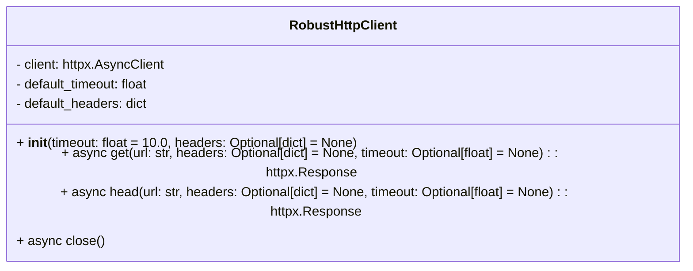
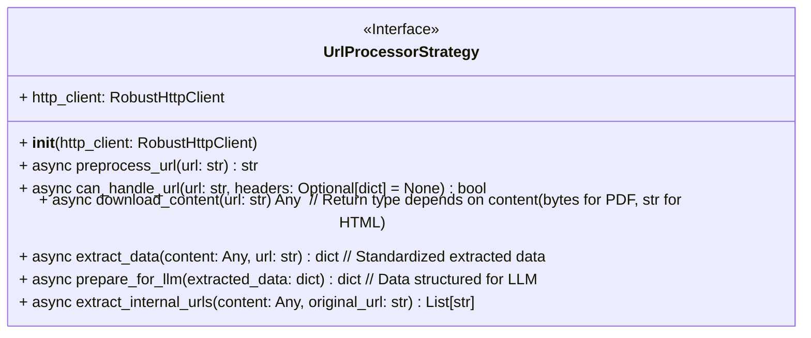
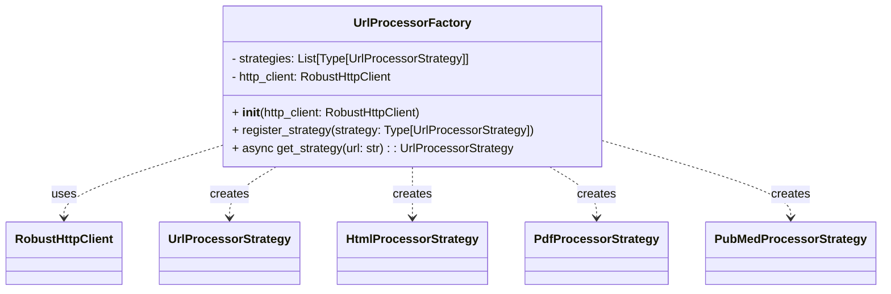
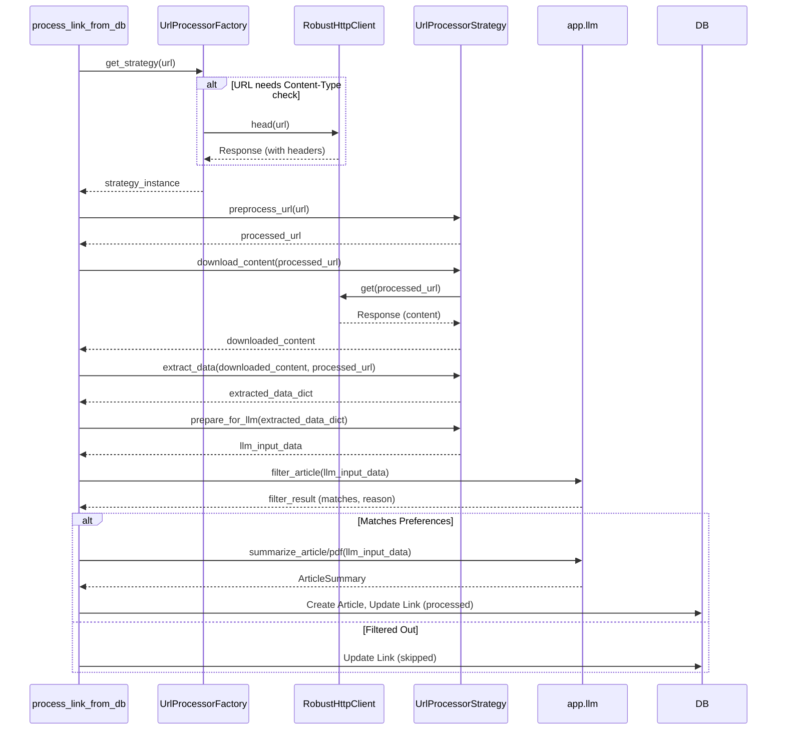
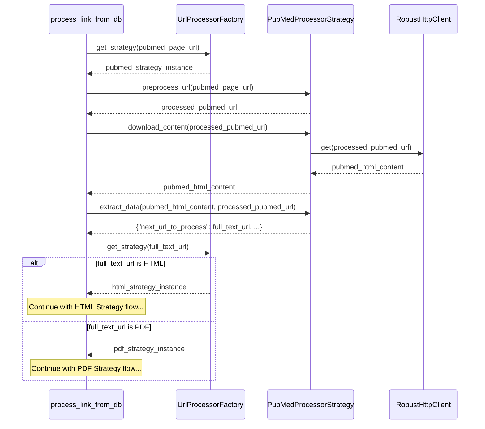

# Task Plan: Refactor URL Processor to Polymorphic Strategies

This document outlines the plan to refactor the current `Processor` class into a modular and extensible system using polymorphic URL handlers.

## Phase 0: Project Setup & Dependencies

-   [ ] Create new directory: `app/processing_strategies/` for strategy implementations.
-   [ ] Create new directory: `app/http_client/` for the `RobustHttpClient`.
-   [ ] Add `httpx` to `pyproject.toml` dependencies:
    ```toml
    # In pyproject.toml under [tool.uv.dependencies]
    httpx = "^0.27.0"
    ```
-   [ ] Run `uv add httpx` to install and update `uv.lock`.

## Phase 1: `RobustHttpClient` Implementation

-   **File**: `app/http_client/robust_http_client.py`
-   **Objective**: Create a dedicated asynchronous HTTP client.



-   **Key Methods & Signatures**:
    -   `__init__(self, timeout: float = 10.0, headers: Optional[dict] = None)`: Initializes `httpx.AsyncClient` with default timeout and headers (e.g., User-Agent).
    -   `async get(self, url: str, headers: Optional[dict] = None, timeout: Optional[float] = None) -> httpx.Response`: Performs an async GET request. Handles redirects by default. Raises custom exceptions for 4xx/5xx errors or uses `response.raise_for_status()`.
    -   `async head(self, url: str, headers: Optional[dict] = None, timeout: Optional[float] = None) -> httpx.Response`: Performs an async HEAD request.
    -   `async close(self)`: Closes the `httpx.AsyncClient`.
-   **Error Handling**:
    -   Wrap `httpx.RequestError` and `httpx.HTTPStatusError` into more specific custom exceptions if needed (e.g., `DownloadError`, `NetworkError`) or rely on httpx exceptions.
    -   Log errors appropriately.
-   **Configuration**: Default timeout, user-agent from `app.config`.

## Phase 2: `UrlProcessorStrategy` Abstract Base Class

-   **File**: `app/processing_strategies/base_strategy.py`
-   **Objective**: Define the interface for all URL processing strategies.


-   **Key Methods & Signatures (Abstract or with default implementation)**:
    -   `__init__(self, http_client: RobustHttpClient)`
    -   `async preprocess_url(self, url: str) -> str`: (Optional) Default returns URL as is.
    -   `async can_handle_url(self, url: str, response_headers: Optional[httpx.Headers] = None) -> bool`: (Abstract) Determines if the strategy can handle this URL/content type. `response_headers` can be passed from a HEAD request made by the factory.
    -   `async download_content(self, url:str) -> Any`: (Abstract) Downloads content. Returns bytes for PDF, text for HTML.
    -   `async extract_data(self, content: Any, url: str) -> Dict[str, Any]`: (Abstract) Extracts title, author, main text, publication date. Returns a standardized dictionary.
        ```python
        # Example standardized extracted_data structure
        # {
        #     "title": "Article Title",
        #     "author": "Author Name",
        #     "publication_date": "YYYY-MM-DD", # or datetime object
        #     "text_content": "Main text content...",
        #     "binary_content_b64": "base64_encoded_pdf_if_applicable", # For PDF
        #     "content_type": "html" # or "pdf"
        #     "final_url_after_redirects": "...",
        #     "original_url_from_db": "..."
        # }
        ```
    -   `async prepare_for_llm(self, extracted_data: Dict[str, Any]) -> Dict[str, Any]`: (Abstract) Prepares data specifically for `app.llm` functions.
        ```python
        # Example LLM input structure (depends on app.llm.py needs)
        # {
        #     "content_to_filter": "text_for_filtering",
        #     "content_to_summarize": "text_or_bytes_for_summarization",
        #     "is_pdf": False # or True
        # }
        ```
    -   `async extract_internal_urls(self, content: Any, original_url: str) -> List[str]`: (Optional) Default returns empty list. For logging related links.

## Phase 3: Concrete Strategy Implementations

### 3.1 `HtmlProcessorStrategy`
-   **File**: `app/processing_strategies/html_strategy.py`
-   **Inherits**: `UrlProcessorStrategy`
-   **Responsibilities**:
    -   `can_handle_url`: Checks if URL points to HTML (e.g., based on `Content-Type` from HEAD request or URL pattern).
    -   `download_content`: Uses `RobustHttpClient.get()` to fetch HTML text.
    -   `extract_data`: Uses `trafilatura.bare_extraction` (similar to current `processor.py`).
    -   `prepare_for_llm`: Formats extracted text for `llm.filter_article` and `llm.summarize_article`.
    -   `preprocess_url`: May handle arXiv `/abs/` to `/pdf/` if we decide not to make a separate ArxivStrategy that would then dispatch to PdfStrategy. For now, assume it might be here or in a dedicated Arxiv strategy.

### 3.2 `PdfProcessorStrategy`
-   **File**: `app/processing_strategies/pdf_strategy.py`
-   **Inherits**: `UrlProcessorStrategy`
-   **Responsibilities**:
    -   `can_handle_url`: Checks if URL points to PDF (e.g., `Content-Type: application/pdf` or URL ending in `.pdf`).
    -   `download_content`: Uses `RobustHttpClient.get()` to fetch PDF bytes.
    -   `extract_data`:
        -   Stores raw PDF bytes (base64 encoded) in `binary_content_b64`.
        -   Sets `content_type: "pdf"`.
        -   Optionally, could attempt text extraction using `pypdf2` or similar if needed *before* LLM, but current `llm.summarize_pdf` takes bytes. For now, focus on passing bytes.
        -   Title might be filename.
    -   `prepare_for_llm`: Passes PDF bytes (base64 encoded or raw bytes as per `llm.py` needs) to `llm.summarize_pdf`. PDFs might bypass `llm.filter_article` or have a simplified filtering.

### 3.3 `PubMedProcessorStrategy`
-   **File**: `app/processing_strategies/pubmed_strategy.py`
-   **Inherits**: `UrlProcessorStrategy`
-   **Responsibilities**:
    -   `can_handle_url`: Checks if URL is a `pubmed.ncbi.nlm.nih.gov` article page.
    -   `download_content`: Fetches the PubMed HTML page.
    -   `extract_data`:
        -   Parses the PubMed HTML (using `BeautifulSoup`, similar to current `extract_pubmed_full_text_link`) to find the *actual* full-text link (e.g., to PMC).
        -   **Crucially, this strategy does not process the final content itself.** It returns a special dictionary indicating the *next* URL to process.
        ```python
        # Example return from PubMedStrategy.extract_data
        # {
        #     "next_url_to_process": "https://www.ncbi.nlm.nih.gov/pmc/articles/PMC12345/",
        #     "original_pubmed_url": "original_url_from_db"
        # }
        ```
    -   `prepare_for_llm`: This method might not be directly used if the strategy always defers. Or it could return a marker.
    -   The factory will then re-evaluate `next_url_to_process` to pick the appropriate (HTML/PDF) strategy.

## Phase 4: `UrlProcessorFactory`

-   **File**: `app/processing_strategies/factory.py`
-   **Objective**: Determine and instantiate the appropriate strategy for a given URL.



-   **Key Methods & Signatures**:
    -   `__init__(self, http_client: RobustHttpClient)`: Initializes with `RobustHttpClient` and a list of registered strategy *classes*.
    -   `register_strategy(self, strategy_class: Type[UrlProcessorStrategy])`: Allows adding new strategies.
    -   `async get_strategy(self, url: str) -> Optional[UrlProcessorStrategy]`:
        1.  Iterate through registered strategies. The `PubMedProcessorStrategy` should likely be checked first due to its specific domain.
        2.  For general URLs, it might make a `HEAD` request using `RobustHttpClient` to get `Content-Type`.
        3.  Call `strategy.can_handle_url(url, response_headers)` for each registered strategy.
        4.  Instantiate and return the first matching strategy.
        5.  Return `None` or raise an exception if no suitable strategy is found.
-   **Strategy Order**: The order of checking strategies can be important (e.g., specific domains like PubMed before generic HTML/PDF).

## Phase 5: LLM Interaction Details

-   Each strategy's `prepare_for_llm` method will be responsible for creating the input dictionary expected by the existing functions in `app/llm.py` (`filter_article`, `summarize_article`, `summarize_pdf`).
-   The `ArticleSummary` Pydantic model from `app/schemas.py` will continue to be the expected output from summarization functions.
-   The `llm.py` module itself might require minor adjustments if the input data structure changes significantly, but the goal is for strategies to adapt to `llm.py`.
-   Assumptions:
    -   `settings.GOOGLE_API_KEY` is configured.
    -   `app.llm` functions handle their own `ClientError` exceptions (e.g., for rate limits), which the main processing loop might need to catch.

## Phase 6: Integration into `app.processor.py`

-   The main function `process_link_from_db(link: Links)` in `app/processor.py` will be refactored.
-   **New Workflow in `process_link_from_db`**:
    1.  Initialize `RobustHttpClient` (ideally once, perhaps managed by a context manager or passed around if `process_link_from_db` is called by a worker).
    2.  Initialize `UrlProcessorFactory` with the `http_client` and register all strategies.
    3.  `current_url_to_process = link.url`
    4.  Loop (to handle PubMed-style delegation):
        a.  `strategy_instance = await factory.get_strategy(current_url_to_process)`
        b.  If no strategy, handle error (log, mark link as failed).
        c.  `processed_url = await strategy_instance.preprocess_url(current_url_to_process)`
        d.  `content_downloaded = await strategy_instance.download_content(processed_url)`
        e.  `extracted_data = await strategy_instance.extract_data(content_downloaded, processed_url)`
            -   `extracted_data` should include `final_url_after_redirects` and `original_url_from_db` (which is `link.url`).
            -   If `extracted_data` contains `{"next_url_to_process": "some_new_url"}` (from `PubMedStrategy`):
                -   `current_url_to_process = extracted_data["next_url_to_process"]`
                -   Log the delegation.
                -   Continue loop to get a new strategy for `some_new_url`.
            -   Else (it's final content):
                -   Break loop.
        f.  `internal_urls = await strategy_instance.extract_internal_urls(content_downloaded, link.url)`
        g.  Log `internal_urls` if any.
    5.  Perform duplicate check using `extracted_data["final_url_after_redirects"]`.
    6.  `llm_input_data = await strategy_instance.prepare_for_llm(extracted_data)`
    7.  Call `llm.filter_article` (if applicable based on `llm_input_data`).
    8.  If matches preferences:
        a.  Call `llm.summarize_article` or `llm.summarize_pdf` using `llm_input_data`.
        b.  Create `Articles` entry using `extracted_data` (title, author, final_url, etc.) and LLM summary.
        c.  Update `Links` status to `processed`.
    9.  Else (filtered out):
        a.  Update `Links` status to `skipped` with reason.
    10. Handle errors from HTTP, strategy execution, or LLM processing at each step, updating `Links` status to `failed` and logging details.
-   The existing `url_preprocessor` function in `app/processor.py` will be mostly superseded. arXiv logic might move to `HtmlProcessorStrategy.preprocess_url` or a new `ArxivStrategy`. PubMed logic moves to `PubMedProcessorStrategy`.
-   The existing `download_and_process_content` function will be removed or heavily refactored into the new strategy-based flow.

## Phase 7: Configuration Management

-   **`RobustHttpClient`**:
    -   Default timeout: `settings.HTTP_CLIENT_TIMEOUT` (new config var).
    -   Default User-Agent: `settings.HTTP_CLIENT_USER_AGENT` (new config var).
-   **LLM**: API keys already in `settings.GOOGLE_API_KEY`.
-   **Strategies**: No specific external configuration anticipated for HTML/PDF initially. PubMed strategy currently scrapes HTML, so no API keys. If Entrez API were used, keys would go in `settings`.

## Phase 8: Error Handling Strategy

-   **`RobustHttpClient`**: Raises `httpx.HTTPStatusError` for 4xx/5xx, `httpx.RequestError` for network issues. These can be caught by strategies or the main loop.
-   **Strategies**:
    -   Download errors: Propagate from `RobustHttpClient`.
    -   Content parsing errors (e.g., Trafilatura fails, PDF unreadable): Raise custom `ParsingError`.
    -   `prepare_for_llm` errors: Raise custom `LLMPreparationError`.
-   **`UrlProcessorFactory`**: Raises `StrategyNotFoundError` if no suitable strategy is found.
-   **Main Processing Loop (`process_link_from_db`)**:
    -   Catches exceptions from factory, strategies, and `app.llm`.
    -   Updates `Links.status` to `failed` or `skipped`.
    -   Records detailed error messages in `Links.error_message` and `FailureLogs` table (using `record_failure`).
    -   Handles `ClientError` from `app.llm` for retries (e.g., 429 rate limit).

## Phase 9: Extensibility

-   To add a new URL/content type handler (e.g., for `ArxivProcessorStrategy`):
    1.  Create a new class inheriting from `UrlProcessorStrategy` (e.g., `app/processing_strategies/arxiv_strategy.py`).
    2.  Implement its abstract methods.
    3.  Register the new strategy class with the `UrlProcessorFactory` instance, typically where the factory is initialized.
    ```python
    # In app/processor.py or where factory is created
    # from app.processing_strategies.html_strategy import HtmlProcessorStrategy
    # from app.processing_strategies.pdf_strategy import PdfProcessorStrategy
    # from app.processing_strategies.pubmed_strategy import PubMedProcessorStrategy
    # from app.processing_strategies.arxiv_strategy import ArxivStrategy # New
    #
    # factory = UrlProcessorFactory(http_client)
    # factory.register_strategy(HtmlProcessorStrategy)
    # factory.register_strategy(PdfProcessorStrategy)
    # factory.register_strategy(PubMedProcessorStrategy)
    # factory.register_strategy(ArxivStrategy) # New
    ```

## Phase 10: Testing Approach

-   **Unit Tests (`app/tests/`)**:
    -   `test_robust_http_client.py`: Mock `httpx.AsyncClient`, test GET/HEAD, error handling, timeouts, headers.
    -   `test_html_strategy.py`: Mock `RobustHttpClient` and `app.llm`. Test `can_handle_url`, `download_content` (mock response), `extract_data` (sample HTML), `prepare_for_llm`.
    -   `test_pdf_strategy.py`: Similar to HTML, using sample PDF bytes.
    -   `test_pubmed_strategy.py`: Test `can_handle_url`, `extract_data` with sample PubMed HTML to ensure correct full-text URL extraction and delegation marker.
    -   `test_url_processor_factory.py`: Mock strategies and `RobustHttpClient`. Test `get_strategy` for different URLs and `Content-Type` headers.
-   **Integration Tests (`app/tests/`)**:
    -   `test_processor_integration.py`: Test the end-to-end flow of `process_link_from_db` with live (but controlled/mocked external) HTTP calls for simple cases if possible, or fully mocked HTTP.
        -   Test HTML processing path.
        -   Test PDF processing path.
        -   Test PubMed delegation path leading to HTML/PDF.
        -   Test error handling and status updates for `Links`.
-   **Test Data**: Use small, self-contained HTML snippets and PDF files for testing extraction.

## Phase 11: Documentation & Memory Bank Update

-   [ ] Update `ai-memory/README.md` with the new architecture details (new classes, workflow).
-   [ ] Ensure this `ai-memory/TASKS.md` is marked as complete or updated with any deviations.
-   [ ] Add docstrings to all new classes and methods.

## Sequence Diagram: Generic URL Processing



## Sequence Diagram: PubMed URL Processing (Delegation)



This plan provides a comprehensive roadmap for the refactoring. Each phase builds upon the previous one, leading to a more robust and maintainable system.