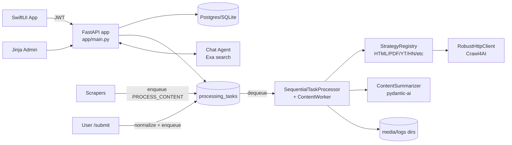

# News App Architecture

> Technical reference for the FastAPI backend, content pipeline, chat system, and SwiftUI client contracts.

**Last Updated:** 2025-11-29  
**Runtime:** Python 3.13, FastAPI + SQLAlchemy 2, Pydantic v2, pydantic-ai  
**Database:** PostgreSQL (prod) / SQLite (dev)  
**Clients:** SwiftUI (iOS 17+), Jinja admin views

## System Overview
- Unified content ingestion (scrapers + user submissions) feeding a DB-backed task queue.
- Processing workers apply URL strategies, fetch/extract content, summarize with LLMs, and persist typed metadata.
- API surface covers auth, feed/list/search, read/favorite state, conversions, tweet ideas, chat, and user-managed scrapers.
- Deep-dive chat uses pydantic-ai agents with Exa web search; conversations are stored server-side.
- Admin/Jinja web UI shares the same services as the mobile API.

## Codebase Map
- `app/main.py` – FastAPI creation, middleware (CORS *), router mounting, startup DB init.
- `app/core/` – settings (`Settings`), DB bootstrap, JWT/security, dependencies, logging helpers.
- `app/models/` – SQLAlchemy tables (`schema.py`, `user.py`), Pydantic metadata/types, pagination helpers, scraper stats dataclass.
- `app/domain/` – converters between ORM and `ContentData` domain model.
- `app/routers/` – auth, admin/content Jinja pages, logs, and API routers under `app/routers/api/`.
- `app/services/` – queue, LLM models/agents/prompts, summarization, chat agent, event logging, HTTP client, scraper config management, tweet suggestions, Exa client, content submission helpers.
- `app/pipeline/` – checkout manager, sequential processor, content worker, podcast download/transcribe workers.
- `app/processing_strategies/` – URL strategy implementations + registry.
- `app/scraping/` – scrapers (HN, Reddit, Substack, Techmeme, podcasts, Atom), runner, base class.
- `client/newsly/` – SwiftUI app consuming the API.

## Core Runtime & Infrastructure
- **FastAPI app (`app/main.py`)**: CORS `*`, static files at `/static`, routers for auth/content/admin/logs/api. Startup event calls `init_db()`. Health at `/health`.
- **Settings (`app/core/settings.py`)**: DB URL + pool tuning, JWT settings, worker timeouts, content length limits, API keys (OpenAI/Anthropic/Google/Exa), HTTP timeouts, Reddit creds, media/log paths, Crawl4AI toggles.
- **Database (`app/core/db.py`)**: lazy engine/session creation, `get_db()` context manager, `get_db_session()` dependency, optional `run_migrations()` helper.
- **Security (`app/core/security.py`)**: JWT create/verify; refresh/access expiries come from settings. Apple token verification currently skips signature validation (dev-only). Admin password check against env.
- **Dependencies (`app/core/deps.py`)**: `get_current_user` via JWT, `get_optional_user`, admin session guard (`require_admin`) using in-memory cookie store `admin_sessions`.
- **Logging (`app/core/logging.py`)**: root logger with structured format; `get_logger()` shortcut.

## Key Classes & Services
| Class | Location | Responsibilities | Key Methods |
|---|---|---|---|
| `Settings` | app/core/settings.py | Env-driven config (DB, JWT, API keys, paths, worker limits) | properties `podcast_media_dir`, `substack_media_dir`, `logs_dir` |
| `QueueService` | app/services/queue.py | DB-backed task queue (SCRAPE/PROCESS_CONTENT/DOWNLOAD_AUDIO/TRANSCRIBE/SUMMARIZE) with retries/stats | `enqueue`, `dequeue`, `complete_task`, `retry_task`, `get_queue_stats`, `cleanup_old_tasks` |
| `CheckoutManager` | app/pipeline/checkout.py | Row-level locking for content checkout/release | `checkout_content` context, `release_stale_checkouts`, `get_checkout_stats` |
| `ContentWorker` | app/pipeline/worker.py | Process articles/news/podcasts: choose strategy, download/extract, summarize, persist | `process_content`, `_process_article`, `_process_podcast` |
| `PodcastDownloadWorker` / `PodcastTranscribeWorker` | app/pipeline/podcast_workers.py | Download audio (with retries) then transcribe via Whisper; queue follow-up tasks | `process_download_task`, `process_transcribe_task` |
| `ContentSummarizer` | app/services/llm_summarization.py | pydantic-ai summarization with per-type default models and cleanup | `summarize`, `summarize_content` |
| `StrategyRegistry` | app/processing_strategies/registry.py | Ordered URL strategy matching | `get_strategy`, `register`, `list_strategies` |
| `RobustHttpClient` | app/http_client/robust_http_client.py | Resilient HTTP GET/HEAD with retries/logging | `get`, `head`, `close` |
| `ScraperRunner` | app/scraping/runner.py | Orchestrates scrapers, logs stats to EventLog | `run_all(_with_stats)`, `run_scraper`, `list_scrapers` |
| `Chat Agent` | app/services/chat_agent.py | pydantic-ai agent with Exa tool, message persistence | `get_chat_agent`, `run_chat_turn`, `generate_initial_suggestions` |
| `Event Logger` | app/services/event_logger.py | Structured event logging to DB | `log_event`, `track_event`, `get_recent_events` |

## Database Schema (ORM in `app/models/schema.py`)
| Table | Purpose | Key Columns/Constraints |
|---|---|---|
| `users` | Accounts from Apple Sign In + admin | `id`, `apple_id` UQ, `email` UQ, `full_name`, `is_admin`, `is_active`, timestamps |
| `contents` | Core content records | `id`, `content_type` (`article/podcast/news`), `url` UQ per type, `title`, `source`, `platform`, `is_aggregate`, `status`, `classification`, `error_message`, `retry_count`, checkout fields, `content_metadata` JSON, timestamps, indexes on type/status/created_at |
| `processing_tasks` | Task queue | `task_type`, `content_id`, `payload` JSON, `status`, retry counters, timestamps, idx on status+created_at |
| `content_read_status` | User read marks | UQ `(user_id, content_id)`, `read_at` |
| `content_favorites` | User favorites | UQ `(user_id, content_id)` |
| `content_unlikes` | User unlikes | UQ `(user_id, content_id)` |
| `content_status` | Per-user feed membership (inbox/archive) | UQ `(user_id, content_id)`, `status`, timestamps |
| `user_scraper_configs` | User-managed feeds (substack/atom/podcast_rss/youtube) | UQ `(user_id, scraper_type, feed_url)`, `config` JSON, `is_active` |
| `event_logs` | Structured event telemetry | `event_type`, `event_name`, `status`, `data` JSON, `created_at` |
| `chat_sessions` | Stored chat threads | `user_id`, `content_id` (optional), `title`, `session_type`, `topic`, `llm_model`, `llm_provider`, `last_message_at`, `is_archived` |
| `chat_messages` | Persisted pydantic-ai messages | `session_id`, `message_list` JSON (ModelMessagesTypeAdapter), `created_at` |

## Domain & Pydantic Types
- **Enums (app/models/metadata.py)**: `ContentType` (`ARTICLE/PODCAST/NEWS`), `ContentStatus` (`new/pending/processing/completed/failed/skipped`), `ContentClassification` (`to_read/skip`).
- **Metadata models**: `ArticleMetadata` (author, publication_date, content, word_count, summary), `PodcastMetadata` (audio_url, transcript, duration, episode_number, YouTube fields, summary), `NewsMetadata` (article: url/title/source_domain; aggregator info; discovery_time; summary `NewsSummary`).
- **Summaries**: `StructuredSummary` (title, overview, bullet_points, quotes, topics, questions, counter_arguments, classification, full_markdown); `NewsSummary` (title, article_url, bullet_points→`key_points`, overview, classification, summarization_date).
- **Domain wrapper**: `ContentData` (id, content_type, url, title, status, metadata dict + computed `display_title`, `short_summary`, `structured_summary`, `bullet_points`, `quotes`, `topics`, `transcript`, `news_items`, `rendered_news_markdown`; timestamps, retry/error fields). Validation enforces metadata shape per type.
- **API schemas (app/routers/api/models.py)**: `ContentSummaryResponse`, `ContentDetailResponse`, `ContentListResponse`, `UnreadCountsResponse`, `SubmitContentRequest` + `ContentSubmissionResponse`, `ConvertNewsResponse`, `TweetSuggestionsRequest/Response`, chat DTOs (`ChatSessionSummaryResponse`, `ChatSessionDetailResponse`, `ChatMessageResponse`, `CreateChatSessionRequest/Response`, `SendChatMessageRequest`).

## API Surface (routers)
- **Auth (`/auth`, app/routers/auth.py)**: `POST /apple` (Apple Sign In, upsert user, returns JWT + optional OpenAI key), `POST /refresh`, admin login/logout pages (Jinja, in-memory sessions).
- **Content list/search (`/api/content`, app/routers/api/content_list.py)**: `GET /` (filters type/date/read, cursor pagination, only summarized/visible items), `GET /search`, `GET /unread-counts` (per type).
- **Content detail/actions**: `GET /{id}` (detail with validated metadata), `GET /{id}/chat-url` (ChatGPT deeplink), `POST /{id}/convert-to-article`, `POST /{id}/tweet-suggestions` (Gemini model defined in `TWEET_SUGGESTION_MODEL`).
- **State**: `POST /{id}/mark-read`, `POST /bulk-mark-read` (read_status), `POST /{id}/favorites/toggle` + `GET /favorites` (favorites).
- **User submissions**: `POST /submit` to create or reuse content, infer type/platform, enqueue processing; returns `task_id` and `already_exists` flag.
- **User scraper configs (`/api/scrapers`)**: CRUD for per-user feed configs; validates `feed_url` and allowed types. Supports type filtering (`?type=podcast_rss` or `?types=substack,atom`) and returns derived `feed_url`/`limit` fields (limit optional 1–100, default 10).
- **Chat (`/api/chat`)**: list/create sessions, get session detail, send message (runs agent and persists), initial suggestions for article sessions.
- **Compatibility**: `app/routers/api_content.py` re-exports the API router for older imports; admin/content/logs routers serve Jinja pages.

## Ingestion & Processing Pipeline
- **Queueing**: Scrapers and `/submit` enqueue `PROCESS_CONTENT` tasks (others for download/transcribe/summarize). Tasks stored in `processing_tasks` with retry counts and `TaskStatus`.
- **Processor (`app/pipeline/sequential_task_processor.py`)**: polls queue, dispatches by `TaskType` (SCRAPE/PROCESS_CONTENT/DOWNLOAD_AUDIO/TRANSCRIBE/SUMMARIZE), exponential backoff retries, graceful signal handling.
- **Checkout (`app/pipeline/checkout.py`)**: optional row-level locks for multi-worker safety; releases stale checkouts back to `new`.
- **ContentWorker flow (`app/pipeline/worker.py`)**:
  1) Load ORM → domain `ContentData`.
  2) Select strategy via `StrategyRegistry` (ordered; HackerNews → Arxiv → PubMed → YouTube → PDF → Image → HTML fallback).
  3) Download (sync/async) via strategy/RobustHttpClient; handle non-retryable HTTP errors.
  4) Extract structured data; handle delegation (`next_url_to_process`), skips (images), or aggregator normalization.
  5) Prepare LLM payload; summarize via `ContentSummarizer` (pydantic-ai prompts in `app/services/llm_prompts.py`).
  6) Persist metadata/summary, update `status` (`completed/failed/skipped`), set `processed_at`; failure paths track `processing_errors` and increment `retry_count`.
- **Podcasts**: `PodcastDownloadWorker` saves audio under `settings.podcast_media_dir`, skips YouTube audio, enqueues transcribe; `PodcastTranscribeWorker` runs Whisper (`app/services/whisper_local.py`), updates metadata, sets status to `completed`.
- **Summarization defaults**: per-type default models (news → `openai:gpt-5-mini`, articles/podcasts → Anthropic Haiku), fallback Gemini Flash; truncates content above 1.5M chars and prunes empty quotes.

## Processing Strategies (`app/processing_strategies/`)
- **HackerNewsProcessorStrategy**: handles HN item URLs, extracts linked article, metadata.
- **ArxivProcessorStrategy**: converts `/abs/` to PDF, feeds PDF strategy.
- **PubMedProcessorStrategy**: domain-specific extraction, may delegate.
- **YouTubeProcessorStrategy**: extracts transcript/metadata; skips summarization when no transcript.
- **PdfProcessorStrategy**: fetches bytes, base64 encodes for multimodal LLM prompt.
- **ImageProcessorStrategy**: detects image URLs and marks `skip_processing`.
- **HtmlProcessorStrategy**: Crawl4AI render + BeautifulSoup metadata; fallback for general web pages.

## Scrapers & Dynamic Feeds
- **BaseScraper (`app/scraping/base.py`)**: ensures `platform` (scraper name) and immutable `source` (feed name/domain); dedupes by URL+type; sets `status=new`, queues processing; ensures per-user inbox rows for articles/podcasts.
- **Runner (`app/scraping/runner.py`)**: sequentially runs `HackerNewsUnifiedScraper`, `RedditUnifiedScraper`, `SubstackScraper`, `TechmemeScraper`, `PodcastUnifiedScraper`, `AtomScraper` (Twitter/YouTube currently disabled); logs stats via `EventLog`.
- **User-managed scrapers**: configs stored in `user_scraper_configs`; `build_feed_payloads` converts configs into feed inputs for scrapers.

## User-Driven Content & State
- **Submissions (`POST /api/submit`)**: normalizes URL, infers type/platform (podcast host heuristics), sets `source="self submission"`, creates `ProcessingTask` if needed, ensures `content_status` inbox row for the submitter.
- **Per-user status**: `ContentStatusEntry` controls visibility in list/search (articles/podcasts require inbox entry; news always visible); `classification` column mirrors summary classification for filtering skips.
- **Read/Favorite/Unlike**: services in `app/services/read_status.py` and `app/services/favorites.py` manage idempotent inserts; list/search include state flags.
- **Conversions/Tweets**: `convert-to-article` clones news article URL into a new article; tweet suggestions generated via Gemini 3 Pro (`google-gla:gemini-3-pro-preview`, `app/services/tweet_suggestions.py`).

## Deep-Dive Chat
- **Data model**: `chat_sessions` + `chat_messages` (serialized pydantic-ai `ModelMessage` lists). Sessions store provider/model, topic/session_type, archive flag.
- **Agent**: `app/services/chat_agent.py` builds pydantic-ai `Agent` with system prompt + Exa search tool (`exa_web_search`); article context pulled from summaries/content; model resolution via `app/services/llm_models.py` (OpenAI/Anthropic/Google with API-key aware construction).
- **Endpoints**: create/list/get sessions, send messages (runs agent, appends DB message list), initial suggestions for article sessions. Message displays extract user/assistant text from stored message lists.

## iOS Client (high level)
- Located in `client/newsly/`; SwiftUI app uses Apple Sign In → `POST /auth/apple`, stores JWT in Keychain, refreshes via `/auth/refresh`.
- API client attaches Bearer tokens, retries on 401 with refresh token; consumes list/search/detail/read/favorites, submission, chat, tweet suggestions endpoints.
- Views model feed (list/search with cursor), detail, favorites, chat sessions/messages; supports share-sheet submissions and topic/ad-hoc chats.

## Security & Observability Notes
- **Gaps**: Apple token signature verification disabled (dev only) in `app/core/security.py`; admin sessions stored in-memory (`app/routers/auth.py`); CORS allows all origins; JWT secret/ADMIN_PASSWORD must be provided via env.
- **Logging/Telemetry**: request logging middleware; structured `EventLog` via `log_event/track_event`; processing errors captured with `app/utils/error_logger.py` helpers; content metadata stores `processing_errors` on failures.
- **Storage**: media/log paths default to `./data/media` and `./logs` (settings override); podcast downloads sanitized to filesystem-safe names.

## Data Flow Cheat Sheet
1) Scrapers or `/submit` create `contents` rows → enqueue `PROCESS_CONTENT` task.
2) `SequentialTaskProcessor` dequeues → `ContentWorker` selects strategy, downloads, extracts, summarizes → updates `contents.status` + metadata/summary.
3) Podcasts: download → transcribe → summarize; tasks chained via queue.
4) API list/search filters: only summarized articles/podcasts + completed news, excludes `classification=skip`, requires `content_status` inbox rows for per-user feeds.
5) Chat sessions reference `contents` (optional) and persist assistant/user messages; Exa search tool available when `EXA_API_KEY` is set.
