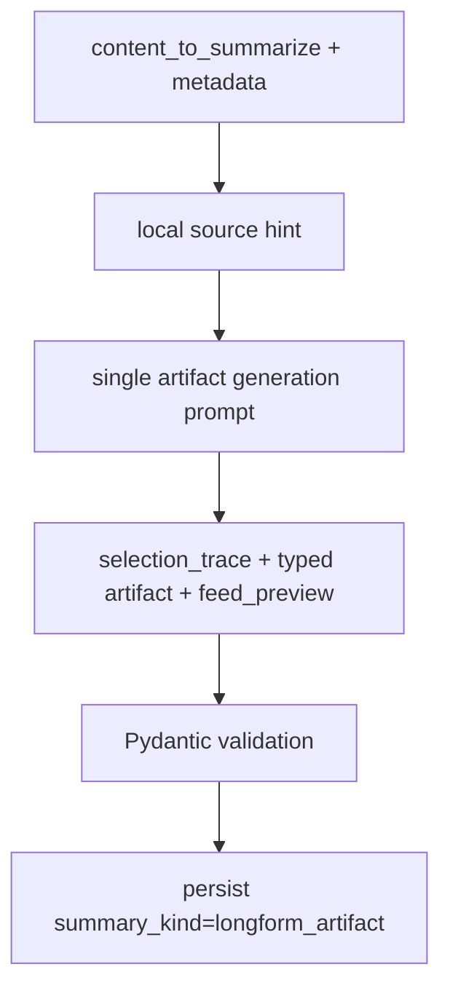

# Longform Artifact System Plan

**Opened:** 2026-04-28  
**Status:** Proposed  
**Scope:** long-form and news summarization contracts, prompt routing, API projection, iOS rendering  
**Primary goal:** replace new long-form/news summaries with typed artifacts that preserve source signal and render through artifact-specific views

---

## Summary

New long-form/news content should use a `longform_artifact` summary contract instead of the current long-form variants. There is no feature-flag phase and no migration requirement for existing rows. Legacy parsers and views can remain so old rows still open, but new generated content should go straight through the artifact path.

The generation flow should use one LLM call for both artifact selection and artifact generation. A local deterministic source-hint step narrows the candidate artifact types. The LLM then selects one candidate, records the selection trace, and emits the typed artifact payload in the same response.

---

## Goals

- Generate new long-form/news items as typed artifacts.
- Collapse new long-form generation onto `summary_kind = "longform_artifact"`.
- Use a uniform envelope and five-block payload shape across artifact types.
- Preserve type-specific structure through strict Pydantic payload models.
- Render detail screens with artifact-specific SwiftUI views.
- Generate feed previews alongside the artifact, not by deriving list text from the detail renderer.
- Keep the generation path simple: no separate classifier LLM pass and no feature flags.

## Non-Goals

- No migration or batch conversion for existing `long_editorial_narrative`, `long_structured`, `long_interleaved`, or `long_bullets` rows.
- No compatibility backfill of old summaries for newly generated rows.
- No separate classifier task or second LLM request for artifact selection.
- No broad rewrite of the extraction/download pipeline.
- No removal of old readers/renderers until old rows and app versions no longer need them.

---

## Artifact Contract

### Summary Kind

New long-form/news artifact rows use:

```text
summary_kind = "longform_artifact"
summary_version = 1
summary = LongformArtifactEnvelope
```

The remaining supported summary families after the change are:

```text
short_news
daily_rollup
longform_artifact
insight_report
```

Legacy summary kinds remain readable but are not generated for new long-form/news content.

### Envelope

```yaml
title: string
one_line: string
ask: judge | learn | copy | absorb | track | try | update
artifact:
  type: argument | mental_model | playbook | portrait | briefing | walkthrough | findings
  payload: typed payload
generated_at: datetime
source_context:
  url: string
  source_name: string | null
  publication_date: string | null
  platform: string | null
selection_trace:
  source_hint: string
  candidates: artifact_type[]
  selected: artifact_type
  reason: string
  confidence: number
feed_preview:
  title: string
  one_line: string
  preview_bullets: string[]
  reason_to_read: string
  artifact_type: artifact_type
```

Do not include envelope-level `summary`, `key_points`, `source_details`, or `classification`.

### Universal Payload Shape

Every artifact payload has:

```yaml
overview: string
quotes:
  - text: string
    attribution: string | null
extras: typed extras model
key_points:
  - heading: string
    content: string
takeaway: string
```

`extras` is the only field whose schema differs by artifact type. `key_points` are always heading plus real content, but their meaning is type-specific.

### Artifact Types

| Type | Ask | Used For | Extras |
| --- | --- | --- | --- |
| `argument` | `judge` | Essays, op-eds, manifestos, Substack analysis | `thesis`, `counterpoint` |
| `mental_model` | `learn` | Explainers, frameworks, conceptual deep-dives | `what_it_explains`, `when_to_use_it` |
| `playbook` | `copy` | Practitioner case studies, tactical interviews | `situation`, `outcome` |
| `portrait` | `absorb` | Profiles, biographical interviews, person-centered Q&A | `background`, `current_focus` |
| `briefing` | `track` | News events, announcements, digests, regulatory updates | `timeline[]`, `key_actors[]`, `what_to_watch` |
| `walkthrough` | `try` | Tutorials, recipes, GitHub READMEs, build guides | `what_youll_make`, `prereqs[]`, `time_or_cost` |
| `findings` | `update` | Papers, benchmarks, data-driven reports | `question`, `method`, `limits` |

---

## Selection And Generation Flow

Use one LLM pass after local source hinting.



### Local Source Hint

The local source-hint function reads URL, platform, content type, and metadata. It returns a hint plus candidates, not a final decision.

Examples:

```yaml
source_hint: substack:analysis
candidates: [argument, mental_model, findings]
```

```yaml
source_hint: github:repo
candidates: [walkthrough, playbook, mental_model]
```

```yaml
source_hint: paper:research
candidates: [findings, mental_model, briefing]
```

### Single LLM Prompt

The prompt receives:

- source hint
- candidate artifact types
- compact artifact definitions
- content title/source/url/platform
- source text
- strict output schema

The model must:

1. Pick exactly one candidate artifact type.
2. Fill `selection_trace`.
3. Generate the matching `artifact.payload`.
4. Generate `feed_preview`.

The selection is part of the artifact response, not a separate LLM call.

### Validation And Repair

Validate against the strict `LongformArtifactEnvelope` model.

If validation fails:

- run one targeted repair pass with the invalid JSON and validation errors
- do not rerun source selection separately
- if repair fails, mark the summarize task failed/non-retryable with structured error context

---

## Backend Implementation Plan

### 1. Add Artifact Models

Add a dedicated module:

```text
app/models/longform_artifacts.py
```

Define:

- `LongformArtifactEnvelope`
- `LongformArtifactBody`
- `ArtifactType`
- `ArtifactAsk`
- `ArtifactQuote`
- `ArtifactKeyPoint`
- `FeedPreview`
- `SelectionTrace`
- seven strict payload models
- seven strict extras models

Use Pydantic discriminators for `artifact.type`. Forbid extra fields on envelope, payloads, and extras.

Touchpoints:

- `app/constants.py`
- `app/models/contracts.py`
- `app/models/metadata.py`
- `app/models/summary_contracts.py`

### 2. Add Longform Source Hinting

Add:

```text
app/services/longform_artifact_routing.py
```

Responsibilities:

- map URL/platform/content metadata to candidate artifact types
- return `source_hint` and candidates
- avoid LLM calls
- keep default fallback as `briefing` if no strong hint exists

This replaces source-specific final routing for new long-form/news artifact generation. Legacy `resolve_summarization_prompt_route()` can remain for old code paths and tests.

### 3. Add Artifact Prompts

Add:

```text
app/services/longform_artifact_prompts.py
```

Responsibilities:

- common artifact boilerplate
- compact type definitions
- per-type content instructions
- strict JSON output instructions
- feed-preview instructions

The prompt framing should be “produce this artifact,” not “summarize this content.”

### 4. Add Generation Service

Add:

```text
app/services/longform_artifact_generation.py
```

Responsibilities:

- build source hint
- build prompt
- invoke the existing LLM agent/model infrastructure
- validate output
- run targeted repair when needed
- return typed `LongformArtifactEnvelope`

Keep `ContentSummarizer` for `short_news` and legacy paths, but use the new generation service for new long-form/news artifacts.

### 5. Update Summarize Handler

Update `app/pipeline/handlers/summarize.py`.

For new article/podcast/news artifact generation:

1. Build summarization payload as today.
2. Call longform artifact generation.
3. Persist:

```yaml
summary_kind: longform_artifact
summary_version: 1
summary: artifact envelope
feed_preview: artifact.feed_preview
selection_trace: artifact.selection_trace
summarization_date: now
summarization_input_fingerprint: fingerprint
```

4. Set content title from `artifact.title`.
5. Continue existing status/image enqueue behavior.

News-specific short-form paths can remain `short_news` where the fast-read pipeline still needs compact story cards. Long-form/detail-oriented news artifacts should use `briefing`.

### 6. Update API Projection

Update:

- `app/models/api/common.py`
- `app/routers/api/content_responses.py`
- metadata access helpers as needed

Add response fields:

```yaml
longform_artifact: object | null
feed_preview: object | null
artifact_type: string | null
preview_bullets: string[] | null
reason_to_read: string | null
```

For list/card responses:

- title: `feed_preview.title` or envelope title
- short summary: `feed_preview.one_line` or envelope `one_line`
- primary topic/chrome: artifact type

For detail responses:

- return `longform_artifact`
- keep old `structured_summary`, `bullet_points`, and `quotes` fields best-effort for old rows only

### 7. Update Hidden Consumers

Before relying on artifacts in production, update old-shape consumers.

#### Image Generation

Update `app/services/image_generation.py` to extract:

- title from envelope title
- overview from `one_line` or payload overview
- key points from payload key point heading/content
- visual hints from artifact type and extras

#### Tweet Suggestions

Update `app/services/tweet_suggestions.py` to extract:

- summary from `one_line` or payload overview
- key points from payload key points
- quotes from payload quotes
- artifact type as style/context signal

#### Readiness

Update `app/models/content_display.py` so long-form content is ready when:

- `summary_kind == "longform_artifact"`
- artifact validates or has required envelope fields
- `feed_preview` is present or can be read from the envelope

#### Search/Card Projection

Ensure search and card text include:

- title
- one_line
- payload overview
- key point headings/content
- takeaway
- feed preview bullets

---

## iOS Implementation Plan

### 1. Add Models

Add models beside `StructuredSummary.swift` or in a new file:

```text
LongformArtifact.swift
```

Models:

- `LongformArtifactEnvelope`
- `Artifact`
- `ArtifactType`
- `ArtifactAsk`
- `ArtifactQuote`
- `ArtifactKeyPoint`
- `FeedPreview`
- `SelectionTrace`
- seven payload models
- seven extras models

### 2. Decode From Content Models

Update:

- `ContentSummary.swift`
- `ContentDetail.swift`

Add optional decoded fields:

- `feedPreview`
- `artifactType`
- `longformArtifact`

Keep all legacy summary decoders.

### 3. Add Shared View Primitives

Add shared components:

- `OverviewBlock`
- `QuoteCard`
- `ExtrasPanel`
- `KeyPointList`
- `TakeawayBanner`

### 4. Add Artifact Views

Add:

- `LongformArtifactView`
- `ArgumentView`
- `MentalModelView`
- `PlaybookView`
- `PortraitView`
- `BriefingView`
- `WalkthroughView`
- `FindingsView`

The type-specific views should share the same visual rhythm but render `extras` differently.

### 5. Update Detail Render Priority

In `ContentDetailView`, render:

1. `LongformArtifactView`
2. `EditorialNarrativeSummaryView`
3. `BulletedSummaryView`
4. `InterleavedSummaryV2View`
5. `InterleavedSummaryView`
6. `StructuredSummaryView`
7. text fallback

### 6. Update Long-Form Cards

Update `LongFormCard` to prefer:

- `feedPreview.oneLine`
- `feedPreview.previewBullets`
- artifact type badge/chrome

Fallback to existing `shortSummary`.

---

## Tests

### Backend Model Tests

- all seven artifacts validate
- all seven extras models reject extra fields
- envelope rejects `summary`, `key_points`, `source_details`, `classification`
- artifact type/payload mismatch fails
- feed preview artifact type matches envelope artifact type
- selection trace records source hint, candidates, selected type, reason, confidence

### Routing And Prompt Tests

- URL/platform hints produce expected candidates
- Substack analysis candidates include `argument` and `mental_model`
- GitHub candidates include `walkthrough`
- paper/PDF candidates include `findings`
- Twitter/news/digest candidates include `briefing`
- generation prompt includes only candidate types, not all seven when candidates are known

### Pipeline Tests

- article summarize writes `longform_artifact`
- podcast summarize writes `longform_artifact`
- news artifact path writes `briefing` artifacts where applicable
- fast-read `short_news` path remains unchanged where still used
- invalid artifact output triggers targeted repair
- failed repair marks task failed with useful error context
- unchanged input fingerprint skips regeneration
- image generation still enqueues for ready long-form content

### API Tests

- detail response includes `longform_artifact`
- list response includes `feed_preview`
- list title/summary use feed preview
- old summary rows still return legacy fields
- `short_news` rows are unchanged
- generated OpenAPI includes new optional fields

### iOS Tests

- Swift decodes all artifact types
- Swift decodes feed preview
- detail renders `LongformArtifactView` before legacy views
- legacy summary rows still render
- malformed/missing artifact falls back cleanly
- long-form card uses feed preview when present

---

## Build Order

1. [x] Add backend models and summary kind constants.
2. [x] Add source-hint routing.
3. [x] Add single-pass artifact prompt/generation service.
4. [x] Wire summarize handler to write `longform_artifact` for new applicable content.
5. [x] Add API response fields and feed-preview projection.
6. [x] Update image generation, tweet suggestions, readiness, and search/card extraction.
7. [x] Add Swift models.
8. [x] Add shared Swift artifact primitives and seven views.
9. [x] Update detail render priority and long-form cards.
10. [x] Run backend tests, OpenAPI generation, and iOS build/tests.

---

## Open Decisions

- Whether all `news` content should become `briefing` artifacts, or only long-form/detail-oriented news while fast-read keeps `short_news`.
- Whether `feed_preview` should live only inside the envelope or also be duplicated at metadata top level for faster projection. The preferred implementation is to keep it in the envelope and duplicate only if repository/query performance needs it.
- Whether image prompts should use artifact-type-specific visual hints from `extras` in the first implementation or start with generic title/overview/key-point extraction.
- Whether `daily_rollup` should be a separate summary kind immediately or introduced after the artifact path lands.

---

## Risk Notes

- The most likely breakage is not schema validation; it is hidden consumers expecting old keys like `editorial_narrative`, `overview`, `hook`, `key_points`, `bullet_points`, and `quotes`.
- A separate classifier LLM pass would add cost and latency without enough benefit. Start with local candidate hinting plus one generation call.
- Strict schemas will increase validation failures early. Keep targeted repair small and observable.
- Keeping old readers is still necessary even without migration, because old rows exist.
- New rows should not generate legacy summary variants, but API/list/search utilities still need artifact-aware projections.
