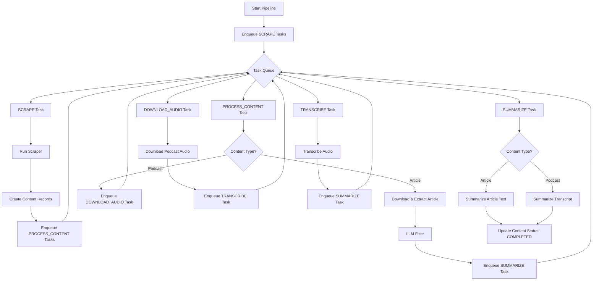

# Unified Pipeline Architecture

## Overview

The unified pipeline architecture provides a task-based processing system for news aggregation and content processing. It replaces the previous direct execution model with a queue-based approach that enables better scalability, error recovery, and monitoring.

## Core Components

### 1. Task Queue System (`app/services/queue.py`)

The queue service manages all processing tasks using a database-backed queue with the following task types:

- **SCRAPE**: Run a specific scraper to collect new content
- **PROCESS_CONTENT**: Process a content item (download, extract, summarize)
- **DOWNLOAD_AUDIO**: Download podcast audio files
- **TRANSCRIBE**: Transcribe podcast audio to text
- **SUMMARIZE**: Generate AI summaries for articles or podcasts

### 2. Task Processor (`app/pipeline/task_processor.py`)

The task processor handles execution of queued tasks:

```python
TaskProcessor
├── process_task()
├── _process_scrape_task()      # Runs scrapers
├── _process_content_task()     # Processes articles/podcasts
├── _process_summarize_task()   # Summarizes content
└── (Delegates to specialized workers for audio tasks)
```

### 3. Content Models (`app/models/unified.py`)

Two primary database tables manage the system:

- **Content**: Stores all content items (articles, podcasts)
- **ProcessingTask**: Manages the task queue

## Pipeline Flow



## Detailed Task Flows

### Article Processing Flow

1. **SCRAPE Task** → Scraper fetches URLs from source
2. Content record created with `status=NEW`
3. **PROCESS_CONTENT Task** enqueued
4. Content downloaded using appropriate strategy (HTML, PDF, etc.)
5. LLM filters content for relevance
6. If relevant, **SUMMARIZE Task** enqueued
7. LLM generates summary
8. Content updated with `status=COMPLETED`

### Podcast Processing Flow

1. **SCRAPE Task** → Podcast RSS scraper finds episodes
2. Content record created with `status=NEW`
3. **PROCESS_CONTENT Task** enqueued
4. **DOWNLOAD_AUDIO Task** enqueued
5. Audio file downloaded to local storage
6. **TRANSCRIBE Task** enqueued
7. Audio transcribed using Whisper model
8. **SUMMARIZE Task** enqueued
9. LLM summarizes transcript
10. Content updated with `status=COMPLETED`

## Key Scripts

### 1. `scripts/run_unified_pipeline.py`

The main orchestration script with multiple execution modes:

```bash
# Full pipeline (scrape + process)
python scripts/run_unified_pipeline.py --mode full

# Only run scrapers
python scripts/run_unified_pipeline.py --mode scrape --scrapers hackernews reddit

# Only process existing content
python scripts/run_unified_pipeline.py --mode process --content-type article

# Process queued tasks only
python scripts/run_unified_pipeline.py --mode tasks --max-workers 5

# Continuous mode
python scripts/run_unified_pipeline.py --mode full --continuous --interval 300
```

### 2. `scripts/run_scrapers_unified.py`

Updated legacy script with task queue support:

```bash
# Use new task queue system (default)
python scripts/run_scrapers_unified.py --scrapers hackernews

# Use legacy direct execution
python scripts/run_scrapers_unified.py --use-legacy
```

## Configuration

### Environment Variables

```bash
# Database
DATABASE_URL=sqlite:///data/database.db

# Worker Configuration
MAX_WORKERS=3
WORKER_TIMEOUT_SECONDS=300

# Retry Configuration
MAX_RETRIES=3

# Queue Settings
QUEUE_BATCH_SIZE=10
```

### Command-Line Arguments

- `--mode`: Execution mode (full, scrape, process, tasks)
- `--scrapers`: Specific scrapers to run
- `--content-type`: Filter by article or podcast
- `--max-workers`: Number of concurrent workers
- `--max-items`: Maximum items to process
- `--continuous`: Run continuously
- `--interval`: Check interval for continuous mode
- `--debug`: Enable debug logging
- `--show-stats`: Display pipeline statistics

## Error Handling and Recovery

### Retry Logic

- Failed tasks automatically retry with exponential backoff
- Retry count tracked in `ProcessingTask.retry_count`
- Max retries configurable via settings
- Failed tasks after max retries marked as `FAILED`

### Error States

1. **Content-level errors**: Stored in `Content.error_message`
2. **Task-level errors**: Stored in `ProcessingTask.error_message`
3. **Checkout timeouts**: Automatic release of stale checkouts
4. **Worker crashes**: Tasks returned to queue for retry

### Monitoring

The pipeline provides comprehensive statistics:

```
PIPELINE STATISTICS
==================================================
Timestamp: 2025-06-13T16:45:00

CONTENT STATUS:
  new         :    150
  processing  :     12
  completed   :   1240
  failed      :      8
  skipped     :     45

QUEUE STATUS:
  pending     :     25
  processing  :      5
  completed   :   1500
  failed      :     10

PENDING TASKS BY TYPE:
  SCRAPE            :      2
  PROCESS_CONTENT   :     15
  DOWNLOAD_AUDIO    :      3
  TRANSCRIBE        :      2
  SUMMARIZE         :      3
```

## Database Schema

### Content Table

```sql
CREATE TABLE contents (
    id INTEGER PRIMARY KEY,
    content_type VARCHAR(20) NOT NULL,
    url VARCHAR(2048) NOT NULL UNIQUE,
    title VARCHAR(500),
    status VARCHAR(20) DEFAULT 'new',
    error_message TEXT,
    retry_count INTEGER DEFAULT 0,
    checked_out_by VARCHAR(100),
    checked_out_at DATETIME,
    content_metadata JSON DEFAULT '{}',
    created_at DATETIME DEFAULT CURRENT_TIMESTAMP,
    updated_at DATETIME DEFAULT CURRENT_TIMESTAMP,
    processed_at DATETIME
);
```

### ProcessingTask Table

```sql
CREATE TABLE processing_tasks (
    id INTEGER PRIMARY KEY,
    task_type VARCHAR(50) NOT NULL,
    content_id INTEGER,
    payload JSON DEFAULT '{}',
    status VARCHAR(20) DEFAULT 'pending',
    created_at DATETIME DEFAULT CURRENT_TIMESTAMP,
    started_at DATETIME,
    completed_at DATETIME,
    error_message TEXT,
    retry_count INTEGER DEFAULT 0
);
```

## Scalability Considerations

### Concurrent Processing

- Multiple workers process different task types simultaneously
- Database-level locking prevents duplicate processing
- Checkout mechanism ensures content isn't processed twice

### Performance Optimizations

1. **Batch Operations**: Tasks processed in batches
2. **Connection Pooling**: Reused database connections
3. **Async I/O**: Non-blocking HTTP requests
4. **Selective Processing**: Content type and status filtering

### Future Enhancements

1. **Distributed Queue**: Redis/RabbitMQ for multi-server deployment
2. **Priority Queues**: High-priority content processing
3. **Rate Limiting**: Per-source rate limits
4. **Webhooks**: Real-time notifications
5. **Metrics Export**: Prometheus/Grafana integration

## Troubleshooting

### Common Issues

1. **Stuck Tasks**: Check for tasks in `processing` status > 1 hour
2. **Failed Scrapers**: Review `ProcessingTask` error messages
3. **Content Processing Failures**: Check `Content.error_message`
4. **Queue Backlog**: Monitor pending task counts

### Debug Commands

```bash
# View queue statistics
python scripts/run_unified_pipeline.py --mode tasks --show-stats

# Process specific content type with debug logging
python scripts/run_unified_pipeline.py --mode process --content-type article --debug

# Run single scraper with verbose output
python scripts/run_unified_pipeline.py --mode scrape --scrapers hackernews --debug
```

## Migration from Legacy System

The new pipeline maintains backward compatibility while adding task queue benefits:

1. **Scrapers**: Now enqueue tasks instead of direct processing
2. **Content Processing**: Uses task queue for better error recovery
3. **Worker Pool**: Replaced with TaskProcessorPool
4. **Statistics**: Enhanced monitoring and reporting

Legacy mode is available via `--use-legacy` flag for testing and comparison.